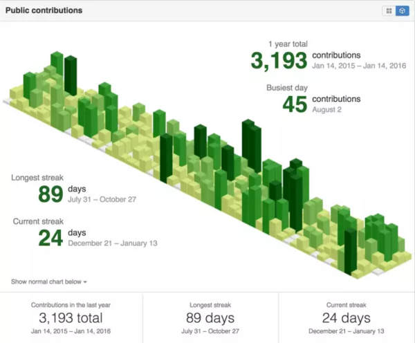
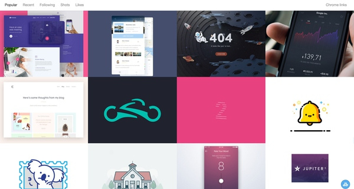
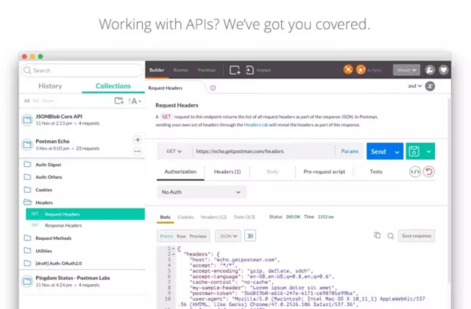
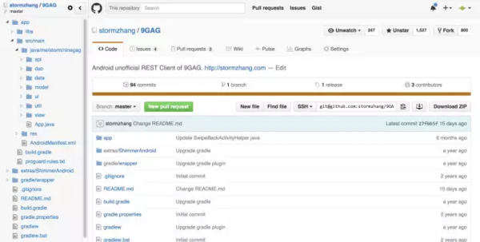

# 好用的Chrome插件
## 1. [Momentum](https://chrome.google.com/webstore/detail/momentum/laookkfknpbbblfpciffpaejjkokdgca)
> 新打开一个Tab的时候再也不是一片空白，每天一副精美图片

## 2. [Isometric Contributions](https://chrome.google.com/webstore/detail/isometric-contributions/mjoedlfflcchnleknnceiplgaeoegien)
> 可以让你在GitHub上的commit像盖楼一样的展示

## 3. [Dribbble New Tab](https://chrome.google.com/webstore/detail/dribbble-new-tab/hmhjbefkpednjogghoibpejdmemkinbn)
> 可以让你打开空白tab的时间第一时间把Dribble每日精选作品展现出来

## 4. [Postman](https://chrome.google.com/webstore/detail/fhbjgbiflinjbdggehcddcbncdddomop)
> 可以直接发送一个请求，自定义params、header，查看response状态等

## 5. [Octotree](https://github.com/buunguyen/octotree)
> 直接在Chrome侧边栏向打开文件夹一样的查看别人的项目

